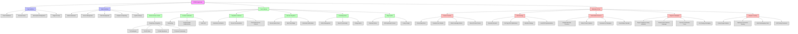

```mermaid
flowchart TD
    %% Main Application Structure
    SPEAR[SPEAR Application] --> UserInterface[User Interface]
    SPEAR --> AdminInterface[Admin Interface]
    SPEAR --> CoreFeatures[Core Features]
    SPEAR --> MarketingToDos[Marketing To-Dos]

    %% User Interface Breakdown
    UserInterface --> Dashboard[Client Dashboard]
    UserInterface --> RemoteAccess[Remote Access]
    UserInterface --> Subscriptions[Subscription Management]
    UserInterface --> Support[Support & Help]

    %% Admin Interface Breakdown
    AdminInterface --> AdminDashboard[Admin Dashboard]
    AdminInterface --> DeviceManagement[Device Management]
    AdminInterface --> ClientManagement[Client Management]
    AdminInterface --> Analytics[Analytics & Reporting]
    AdminInterface --> Settings[System Settings]

    %% Core Features Breakdown
    CoreFeatures --> RemoteControl[Remote Device Control]
    RemoteControl --> TeamViewerInt[TeamViewer Integration]

    CoreFeatures --> LocationVerification[Location Verification]
    CoreFeatures --> ComplianceSolutions[Compliance Solutions]
    CoreFeatures --> DiscordInt[Discord Integration]
    CoreFeatures --> KnowledgeBase[Knowledge Base]
    CoreFeatures --> BlogSystem[Blog System]

    %% Remote Control Details
    TeamViewerInt --> TVDashboard[TV Dashboard]
    TeamViewerInt --> TVStatus[TV API Status]
    TeamViewerInt --> TVBulkOps[TV Bulk Operations]
    TeamViewerInt --> TVProvisioning[TV Device Provisioning]


    %% Location Verification Details
    LocationVerification --> Geofencing[Geofencing]
    LocationVerification --> LocationAuth[Location-based Authentication]
    LocationVerification --> AuditTrail[Audit Trail]

    %% Compliance Solutions Details
    ComplianceSolutions --> AutoVerification[Automated Verification]
    ComplianceSolutions --> SecureDocumentation[Secure Documentation]
    ComplianceSolutions --> TimeBasedAccess[Time-based Access Controls]

    %% Discord Integration Details
    DiscordInt --> AdminPanel[Discord Admin Panel]
    DiscordInt --> MiniChat[Mini Chat Widget]
    DiscordInt --> Notifications[Automated Notifications]

    %% Knowledge Base Details
    KnowledgeBase --> Articles[Article Management]
    KnowledgeBase --> Search[Search Functionality]
    KnowledgeBase --> Categories[Categorization]

    %% Blog System Details
    BlogSystem --> FeaturedArticles[Featured Articles]
    BlogSystem --> SEOContent[SEO-optimized Content]
    BlogSystem --> LuxuryDesign[Luxury Design]

    %% Marketing To-Dos
    MarketingToDos --> ContentCreation[Content Creation]
    MarketingToDos --> SEOStrategy[SEO Strategy]
    MarketingToDos --> SocialMedia[Social Media Presence]
    MarketingToDos --> TargetedCampaigns[Targeted Campaigns]
    MarketingToDos --> AnalyticsTracking[Analytics Tracking]

    %% Content Creation To-Dos
    ContentCreation --> BlogPosts[Create Blog Posts]
    ContentCreation --> CaseStudies[Develop Case Studies]
    ContentCreation --> KnowledgeArticles[Write Knowledge Articles]
    ContentCreation --> ProductDemos[Record Product Demos]

    %% SEO Strategy To-Dos
    SEOStrategy --> KeywordResearch[Keyword Research]
    SEOStrategy --> OnPageSEO[On-Page SEO Optimization]
    SEOStrategy --> BacklinkStrategy[Backlink Strategy]
    SEOStrategy --> LocalSEO[Local SEO Implementation]

    %% Social Media To-Dos
    SocialMedia --> LinkedInPresence[LinkedIn Business Presence]
    SocialMedia --> TwitterUpdates[Twitter Product Updates]
    SocialMedia --> FacebookAds[Facebook Ad Campaigns]
    SocialMedia --> ContentCalendar[Social Media Calendar]

    %% Targeted Campaigns To-Dos
    TargetedCampaigns --> ComplianceIndustries[Target Compliance-Heavy Industries]
    TargetedCampaigns --> RemoteWorkSolutions[Remote Work Solutions Campaign]
    TargetedCampaigns --> SecurityFocus[Security & Verification Focus]
    TargetedCampaigns --> CostSavings[Cost Savings Messaging]

    %% Analytics Tracking To-Dos
    AnalyticsTracking --> SetupGA[Setup Google Analytics]
    AnalyticsTracking --> ConversionTracking[Implement Conversion Tracking]
    AnalyticsTracking --> HeatMapping[Install Heatmapping Tools]
    AnalyticsTracking --> ABTesting[A/B Testing Framework]

    %% Styling
    classDef core fill:#f9f,stroke:#333,stroke-width:2px
    classDef interface fill:#bbf,stroke:#333,stroke-width:1px
    classDef feature fill:#bfb,stroke:#333,stroke-width:1px
    classDef marketing fill:#fbb,stroke:#333,stroke-width:1px
    classDef detail fill:#ddd,stroke:#333,stroke-width:1px

    class SPEAR core
    class UserInterface,AdminInterface interface
    class CoreFeatures,RemoteControl,LocationVerification,ComplianceSolutions,DiscordInt,KnowledgeBase,BlogSystem feature
    class MarketingToDos,ContentCreation,SEOStrategy,SocialMedia,TargetedCampaigns,AnalyticsTracking marketing
    class Dashboard,RemoteAccess,Subscriptions,Support,AdminDashboard,DeviceManagement,ClientManagement,Analytics,Settings detail
    class TeamViewerInt,Geofencing,LocationAuth,AuditTrail,AutoVerification,SecureDocumentation,TimeBasedAccess detail
    class TVDashboard,TVStatus,TVBulkOps,TVProvisioning detail
    class AdminPanel,MiniChat,Notifications,Articles,Search,Categories,FeaturedArticles,SEOContent,LuxuryDesign detail
    class BlogPosts,CaseStudies,KnowledgeArticles,ProductDemos,KeywordResearch,OnPageSEO,BacklinkStrategy,LocalSEO detail
    class LinkedInPresence,TwitterUpdates,FacebookAds,ContentCalendar,ComplianceIndustries,RemoteWorkSolutions,SecurityFocus,CostSavings detail
    class SetupGA,ConversionTracking,HeatMapping,ABTesting detail
```
